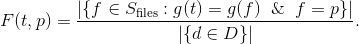
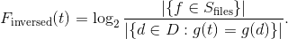
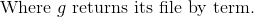

# Foogle

Foogle is Search Engine with Ranking writed in [Python](https://www.python.org/).

## Usage

### To compile date base

    py foogle.py compile myfiles

### To find files with words

    py foogle.py find myfiles "TODO and not DONE"

## Runking

Use typical [TF-IDF](https://en.wikipedia.org/wiki/Tf%E2%80%93idf) ranking. Where:

TF:



<!-- $$F(t, p) ={|\{f\in S_\text{files}:g(t)=g(f)\And f = p\}|\over|\{d\in D\}|}.$$ -->
IDF:






<!-- $$F_\text{inversed}(t) =\log_2{|\{f\in S_\text{files}\}|\over|\{d\in D: g(t)= g(d) \}|}. -->
<!-- .$$ -->
<!-- $$\text{Where } g\text{ returns it's file by term.}$$ -->

Support search operators: _not_, _or_, _and_.

Support config file:

```yaml
foogle:
  logging_file_name: mylog.log  
  types:
    - text*
    - application/j
  date_base_name: mydb.db
  extention_types:
    - .h
    - .sh
    - .doc
  general_path:
```
